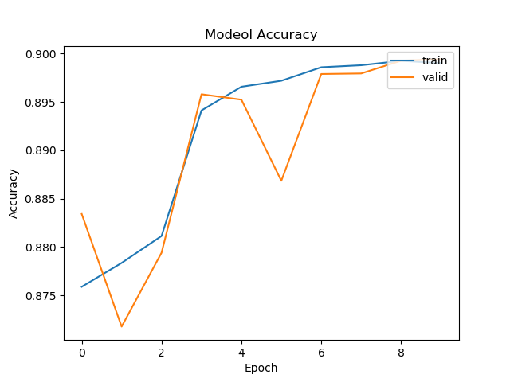

# Histopathologic-Cancer-Detection

The data for this competition is a slightly modified version of the PatchCamelyon (PCam)benchmark dataset. The main aim of the project is to create an algorithm to identify metastatic cancer in small image patches taken from larger digital pathology scans. Our algorithm is a CNN (Convolutional Neural Network) with various data augmentation to classify the normal and abnormal patches. The algorithm succeeded with 0.85 accuracy and further improvement is invloved continuosly. 

In this kaggle competition modified PCam dataset is given. From that we have to detect whether a Whole-slide images
is having benign or malignant tumour cells in its center 32 x 32 pixel.

## DATASET:

* Train data - 2,20,025
* Test data  - 57,458

### NOTE:

In the given "Histopathology.py" file the commented lines are the various trials we made before using DenseNet121 Architecture

## Trail 1 : (Using Seperable Convolution)

* Training Accuracy - 71 %
* Validation Accuracy - 77 %

## Trail 2 : (Using Convolution)

Below graph is for 26-30 epochs

* Training Accuracy -  89.99%
* Validation Accuracy - 89.92 %

## Trail 3 : (DenseNet121)

## System

8 CPU, 16GB RAM, Paperspace GPU
